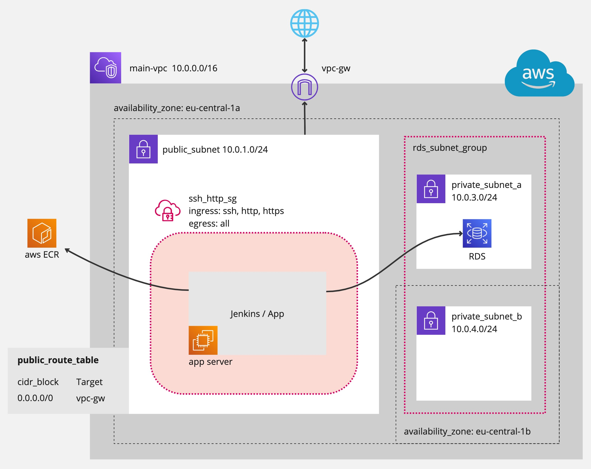

# Final Simplified Version



# Habit Tracker Infrastructure Setup

## 1. VPC Configuration
- **VPC:** `habit-tracker-vpc` (CIDR Block: `10.0.0.0/16`)
- **Subnets:**
  - **Staging Public Subnet:** `10.0.1.0/24` (for bastion, NAT gateway, staging load balancer)
  - **Staging Private Subnet:** `10.0.2.0/24` (for app, Jenkins, RDS)
  - **Production Public Subnet:** `10.0.3.0/24` (for bastion, NAT gateway, production load balancer)
  - **Production Private Subnet:** `10.0.4.0/24` (for app, Jenkins, RDS)

## 2. Internet Connectivity
- **Internet Gateway (igw)**: Attached to VPC for internet access to public subnets.
- **NAT Gateways:**
  - `nat_staging`: Deployed in staging public subnet.
  - `nat_production`: Deployed in production public subnet.

## 3. Subnets and Resources
### Public Subnets
#### Staging Public Subnet (`10.0.1.0/24`)
- **Bastion Host:** `staging_bastion` (SSH, HTTP/HTTPS, ICMP)
- **NAT Gateway:** `nat_staging`
- **Load Balancer:** `staging_lb` (HTTP/HTTPS, forwards traffic to app instances)

#### Production Public Subnet (`10.0.3.0/24`)
- **Bastion Host:** `production_bastion`
- **NAT Gateway:** `nat_production`
- **Load Balancer:** `production_lb`

### Private Subnets
#### Staging Private Subnet (`10.0.2.0/24`)
- **Application EC2 Instances:** Registered with `app_tg`.
- **Jenkins EC2 Instance:** CI/CD workflows, connects to AWS ECR.
- **RDS Instance:** Stores app-related data.

#### Production Private Subnet (`10.0.4.0/24`)
- **Application EC2 Instances:** Registered with `app_tg`.
- **Jenkins EC2 Instance:** CI/CD workflows, connects to AWS ECR.
- **RDS Instance:** Stores app-related data.

## 4. Security Groups
### Bastion Security Group (`bastion_sg`)
- **Ingress:** SSH (22), ICMP, HTTP/HTTPS (trusted IPs)
- **Egress:** Allow all traffic

### App Security Group (`app_sg`)
- **Ingress:** HTTP/HTTPS from `staging_lb` and `production_lb`, SSH from `bastion_sg`
- **Egress:** Traffic to RDS, ECR, and necessary services

## 5. Load Balancers
- **Staging LB:** HTTP/HTTPS (targets `app_tg` in staging private subnet)
- **Production LB:** HTTP/HTTPS (targets `app_tg` in production private subnet)

## 6. Routing and Connectivity
- **Public Subnet Route Tables:**
  - Routes local traffic within VPC
  - Default route to Internet Gateway
- **Private Subnet Route Tables:**
  - Routes local traffic within VPC
  - Default route to NAT Gateway

## 7. Infrastructure Setup with Terraform & Ansible
### Terraform
1. **Install Terraform** (`terraform -v`)
2. **Initialize Terraform:** `terraform init`
3. **Plan Infrastructure:** `terraform plan -out=tfplan`
4. **Apply Configuration:** `terraform apply tfplan`
5. **Verify Outputs:** Check Terraform output values
6. **Access Resources:** View AWS Console resources
7. **Update Resources:** Modify Terraform files, rerun `terraform plan` & `terraform apply`
8. **Destroy Resources (Optional):** `terraform destroy`

### Terraform Directory Structure
```
terraform/
├── main.tf           # Shared configurations
├── variables.tf      # Variables for all environments
├── outputs.tf        # Outputs for all environments
├── staging.tfvars    # Staging environment variables
└── production.tfvars # Production environment variables
```

## 8. Kubernetes Setup
- **Kubernetes Master Nodes:** 2 EC2 instances (staging & production)
- **Kubernetes Clusters:** Each contains 3 nodes (Next.js, Jenkins, ArgoCD)
- **RDS:** 2 databases (staging & production)
- **Security Groups:**
  - **Master Node:** Allow port 6443
  - **Worker Nodes:** Allow HTTP/HTTPS, internal cluster communication
  - **RDS:** Allow port 5432 from worker nodes
  - **Jenkins:** Allow port 8080 (trusted IPs only)
  - **ArgoCD:** Allow port 8080 or Ingress (trusted sources)

## 9. Load Balancer & SSL Configuration
- **ALB:** Handles HTTP (80) and HTTPS (443) traffic
- **ACM Certificate:** SSL certificate from AWS ACM
- **Target Group:** Routes traffic to Kubernetes pods
- **Security Groups:** ALB allows HTTP/HTTPS, Kubernetes nodes allow traffic from ALB
- **Kubernetes Integration:**
  - Service type `LoadBalancer`
  - AWS Load Balancer Controller for ALB provisioning

## 10. Ansible Setup
### SSH Key Generation
```sh
ssh-keygen -t rsa -b 4096 -f ~/.ssh/habit-tracker-key -C "your-email@example.com"
```
- Private Key: `~/.ssh/habit-tracker-key` (Keep secure)
- Public Key: `~/.ssh/habit-tracker-key.pub` (Upload to AWS)

### Running Ansible Playbooks
```sh
ansible-playbook -i ansible/inventories/staging.ini ansible/playbooks/k8s-master.yml
ansible-playbook -i ansible/inventories/staging.ini ansible/playbooks/k8s-workers.yml
ansible-playbook -i ansible/inventories/production.ini ansible/playbooks/k8s-master.yml
ansible-playbook -i ansible/inventories/production.ini ansible/playbooks/k8s-workers.yml
```

## 11. Summary
1. **1 VPC**
2. **4 Subnets**: Public & Private (Staging, Production)
3. **Security Groups**: RDS, Kubernetes, Next.js, Jenkins, ArgoCD
4. **IAM Roles** for EC2
5. **EC2 Instances**:
   - **K8s Master Nodes**: 2 (Staging, Production)
   - **Worker Nodes**: 3 per cluster (Next.js, Jenkins, ArgoCD)
   - **RDS Instances**: 2
6. **Load Balancers & SSL** for Next.js
7. **CI/CD Pipeline**: Jenkins & ArgoCD
8. **Monitoring** (Optional): Grafana, Prometheus, Metabase

